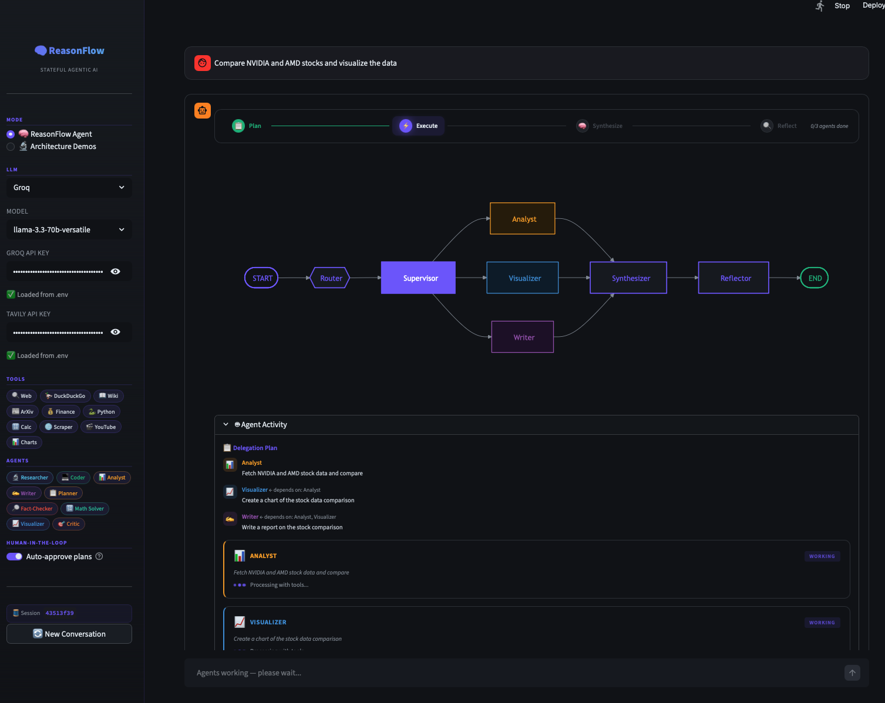
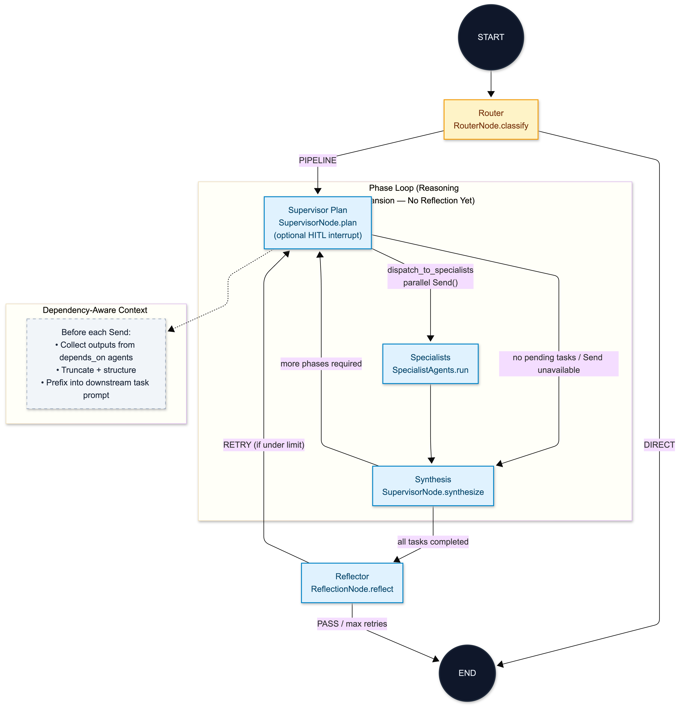

# ReasonFlow

ReasonFlow is a **multi-agent orchestration system** built on top of LangGraph.

It is **not** a simple “LLM with tools” application. Instead, it implements a **stateful execution graph** where multiple agents collaborate through **structured planning, dependency-aware execution, and iterative refinement**.

At its core, ReasonFlow provides:

- **Router-driven execution** — dynamically chooses between single-hop responses and full multi-agent pipelines  
- **Supervisor-led delegation** — structured task planning via a `delegation_plan`  
- **Dependency-aware parallel execution** — DAG-style execution using LangGraph `Send()`  
- **Dual control loops** — separates reasoning expansion from quality assurance  
- **Optional human-in-the-loop (HITL)** — interactive approval for safe execution  

---

## Quick start

**Prerequisites:** Python **3.10+**. All commands below assume your shell’s working directory is the **repository root** (where [`app.py`](app.py) and [`requirements.txt`](requirements.txt) live). The app imports `src.langgraph_agentic_ai`, so running Streamlit from another folder will raise `ModuleNotFoundError`.

1. **Virtual environment (recommended)**

   ```bash
   python3 -m venv .venv
   source .venv/bin/activate          # Windows: .venv\Scripts\activate
   pip install -U pip
   ```

2. **Install dependencies**

   ```bash
   pip install -r requirements.txt
   ```

3. **API keys** — Copy [`.env.example`](.env.example) to `.env` and fill in values, or paste keys in the Streamlit sidebar after launch. You need **at least one** chat provider; Tavily improves search-backed tools.

   | Variable | Role |
   |----------|------|
   | `GROQ_API_KEY` | Groq chat models |
   | `OPENAI_API_KEY` | OpenAI chat models |
   | `TAVILY_API_KEY` | Tavily search in the tool graph |

4. **Run the UI**

   ```bash
   streamlit run app.py
   ```

   Open the local URL Streamlit prints (usually `http://localhost:8501`). In the app, pick **ReasonFlow Agent** (or another graph from the sidebar) to exercise the multi-agent pipeline.



---

## Architecture (ReasonFlow Agent)

The figure below matches [`reasonflow_agent_build_graph`](src/langgraph_agentic_ai/graph/graph_builder.py) in [`graph_builder.py`](src/langgraph_agentic_ai/graph/graph_builder.py), wired by [`setup_graph("ReasonFlow Agent")`](src/langgraph_agentic_ai/graph/graph_builder.py). Other Streamlit use cases compile different graphs from the same module.



| On the diagram | LangGraph node / router | Code key or behavior |
|----------------|-------------------------|----------------------|
| Router | `router` | — |
| Supervisor Plan | `supervisor_plan` | `interrupt()` when HITL `auto_approve` is off |
| Specialists | `specialist` | One node; N concurrent runs via `Send("specialist", …)` |
| Synthesis | `supervisor_synthesize` | — |
| Reflector | `reflector` | — |
| **DIRECT** → END | `route_decision` | `done` |
| **PIPELINE** | `route_decision` | `pipeline` |
| **dispatch_to_specialists · parallel Send()** | `dispatch_to_specialists` | list of `Send` → `specialist` |
| **no pending tasks / Send unavailable** | `dispatch_to_specialists` | routes to `supervisor_synthesize` if the plan is empty, `Send` failed to import, or no task is ready |
| **more phases required** | `check_phases_or_reflect` | `next_phase` → `supervisor_plan` |
| **all tasks completed** | `check_phases_or_reflect` | `reflect` → `reflector` |
| **RETRY (if under limit)** | `should_retry` | `retry` → `supervisor_plan` (bounded by `ReflectionNode.MAX_RETRIES`) |
| **PASS / max retries** | `should_retry` | `done` → END |
| Dependency-Aware Context (dashed) | (inside `dispatch_to_specialists`) | Injects trimmed `depends_on` outputs into task text before each `Send` |

**Source files:** diagram PNG + editable Mermaid — [`architecture_diagram.png`](architecture_diagram.png), [`architecture_diagram.mmd`](architecture_diagram.mmd) (use [mermaid.live](https://mermaid.live) with the `.mmd` frontmatter for theme/export).

---

## At a glance

| Area | What the code does |
|------|---------------------|
| **Graph** | [`reasonflow_agent_build_graph`](src/langgraph_agentic_ai/graph/graph_builder.py) — `router` → `supervisor_plan` → conditional `Send()` / `specialist` → `supervisor_synthesize` → `reflector` → `END` (with loops below). |
| **Routing** | `RouterNode` → `route_decision` → **`done`** (`DIRECT` → END) vs **`pipeline`** → `supervisor_plan`. |
| **Delegation** | `SupervisorNode.plan` → `delegation_plan`: **`agent`**, **`task`**, **`depends_on`**. |
| **Parallelism** | `dispatch_to_specialists` → list of **`Send("specialist", state_slice)`** for tasks whose **`depends_on`** are all satisfied in `agent_results`. |
| **Per specialist** | `SpecialistAgents.run` + `get_specialist_tools()`; ReAct-style loop with **`MAX_TOOL_ITERATIONS`** / **`AGENT_TIMEOUT_SECS`**. |
| **Quality** | `ReflectionNode` → **`verdict`** PASS/RETRY; **`RETRY`** only if `reflection_count < MAX_RETRIES` (2). **`DIRECT`** short-circuits deep reflection. |
| **HITL** | `supervisor_plan` → **`interrupt()`** when `auto_approve` is false; Streamlit resumes via LangGraph **`Command(resume=…)`** ([`main.py`](src/langgraph_agentic_ai/main.py)). |
| **State / memory** | `TypedDict` + checkpointer **`MemorySaver`** per session ([`main.py`](src/langgraph_agentic_ai/main.py)). |

---

## Specialists

| `agent` key | Tools (`get_specialist_tools`) |
|-------------|--------------------------------|
| `researcher` | Tavily, DuckDuckGo, Wikipedia, ArXiv, scrape, YouTube transcript |
| `coder` | Python REPL |
| `analyst` | yfinance, calculator, Tavily |
| `writer` | — |
| `planner` | Tavily, calculator |
| `fact_checker` | Tavily, DuckDuckGo, scrape |
| `math_solver` | calculator, Python REPL |
| `visualizer` | Python REPL (matplotlib in prompts) |
| `critic` | — |

[`planning_node.py`](src/langgraph_agentic_ai/nodes/planning_node.py) exists but is **not** wired in `GraphBuilder`.

---

## Supporting code

- **[`tool_registry.py`](src/langgraph_agentic_ai/tools/tool_registry.py)** — Tool lists per use case and per specialist.
- **[`llm_fallback.py`](src/langgraph_agentic_ai/utils/llm_fallback.py)** — Used on router / specialist paths (e.g. rate limits); behavior is defined in that file.

---

## Design notes

This system goes beyond standard agent frameworks by combining **graph-based execution, parallelism, and multi-stage control logic**:

### Dual control loops

- **Phase loop (reasoning expansion)**  
  `supervisor_synthesize → next_phase → supervisor_plan`  
  - Expands reasoning within the same plan  
  - No quality evaluation on this path  

- **Quality loop (reflection and retry)**  
  `reflect → reflector → retry → supervisor_plan`  
  - Evaluates output quality  
  - Triggers re-planning when needed  
  - Bounded by a retry cap  

### Dynamic parallel fan-out

- `dispatch_to_specialists` returns a **list of `Send("specialist", …)` calls** for all ready tasks  
- Executes tasks **in parallel when dependencies are satisfied**  
- Falls back to **direct synthesis (`supervisor_synthesize`)** when no tasks remain or `Send` is unavailable  

### Dependency-aware prompting

- For tasks with `depends_on`, upstream outputs are:
  - **Automatically injected into downstream prompts**
  - **Truncated and structured for efficiency**
- Implemented in:  
  `graph_builder.py`

### Specialized agent system

- **9 specialist agents**, each with:
  - Distinct tools
  - Tool usage limits (`MAX_TOOL_ITERATIONS`)
  - Execution timeouts (`AGENT_TIMEOUT_SECS`)

Defined in:  
`specialist_agents.py`

### Shared typed state

Centralized state management in:  
`state.py`

Includes:
- Message history (`add_messages`)
- Routing decisions
- Delegation plans
- Reflection outputs
- HITL control flags

Enables:
- Consistency across agents  
- Reproducibility  
- Debuggable execution flows  

---

## Tech stack

- **Orchestration:** LangGraph  
- **Framework:** LangChain (Groq / OpenAI)  
- **UI:** Streamlit  
- **Tools:**  
  - Tavily (search)  
  - Wikipedia  
  - ArXiv  
  - DuckDuckGo  
  - yfinance  
  - Python REPL (`langchain_experimental`)  

Custom tool registry:  
`tool_registry.py`

---

## Project layout

| Path | Role |
|------|------|
| [`result.png`](result.png) | UI screenshot (referenced in Quick start) |
| [`architecture_diagram.png`](architecture_diagram.png) | ReasonFlow Agent graph (exported image) |
| [`architecture_diagram.mmd`](architecture_diagram.mmd) | Same graph — Mermaid source (redux theme in frontmatter) |
| [`app.py`](app.py) | Entry |
| [`src/langgraph_agentic_ai/main.py`](src/langgraph_agentic_ai/main.py) | Session, `_build_graph`, HITL |
| [`src/langgraph_agentic_ai/graph/graph_builder.py`](src/langgraph_agentic_ai/graph/graph_builder.py) | LangGraph definitions |
| [`src/langgraph_agentic_ai/nodes/`](src/langgraph_agentic_ai/nodes/) | Router, supervisor, specialists, reflection, … |
| [`src/langgraph_agentic_ai/tools/`](src/langgraph_agentic_ai/tools/) | Tools + registry |
| [`src/langgraph_agentic_ai/state/state.py`](src/langgraph_agentic_ai/state/state.py) | `State` schema |
| [`src/langgraph_agentic_ai/ui/`](src/langgraph_agentic_ai/ui/) | Streamlit + Mermaid UI |
